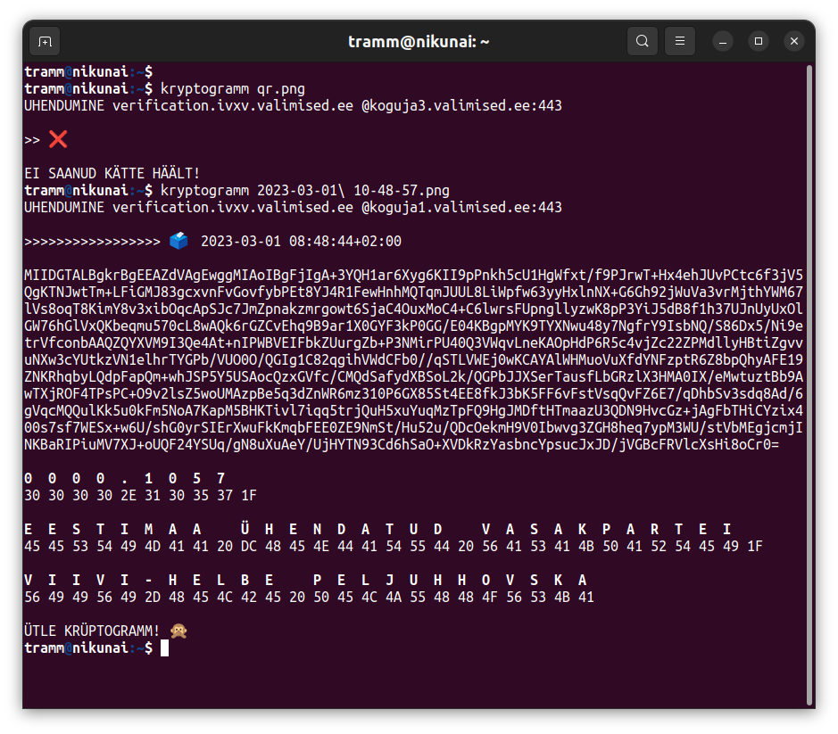

# kryptogramm

Tool for individual vote verification at [Internet enabled](https://github.com/vvk-ehk/ivxv) parliament elections in Estonia 2023. Since we are allowed to verify our vote only up to 30 minutes after casting, we have to make this time really special, don't we?

Usage:

```
./kryptogramm.py qr-code.jpg
```



## What you get

Estonian Internet voting uses individual vote verification up to 30 minutes from [casting the vote](https://youtu.be/GuKiJKL4WdI). Technically, this is done by downloading cryptogram from vote storage server and decrypting it with ElGamal ephemeral key created during encryption at the voting phase. Vote identificator and keys needed for decryption are passed on to secondary device by QR code. Usually you don't get the cryptogram out of proprietary voting application but by default also not from the verification application. With this tool you will get to:

* Decode the QR code encapsulating ElGamal key and vote ID
* Download encrypted ballot for keeping for as long as you want
* Decrypt your encrypted ballot and see who you voted for
* Transparency of human readable/editable Python 200-liner
* Get to understand better how Internet voting works

There is also limit of three attempts of verification per ballot. By using the tool you get full control of the democratic process, you can audit every part of it and make it fit your personal preferences or requirements of digital democracy. Currently that kind of hands on auditing is possible only for very limited parts of the election process.

See the details about [vote verification](https://www.valimised.ee/et/e-haaletamine/e-haaletamisest-lahemalt/haaletamise-kontroll-nutitelefoniga) on Estonian electoral commission [web page](https://www.valimised.ee/et/e-haaletamine/dokumendid) (documentation in Estonian) or check out source code of the [official verification tool](https://github.com/vvk-ehk/ivotingverification).

## Installation instructions

```
git clone https://github.com/infoaed/kryptogramm.git
cd kryptogramm
pip install -r requirements.txt
```

You might also need:

```
sudo apt-get install libzbar0
```

But you might also go directly:

```
sudo apt-get install python3-zbar
```

And if you'd like to run this as a command line tool:

```
hatch build
pip install dist/kryptogramm-0.0.1.tar.gz
```
## But why?

If you like this tool, you may also want to check out [Pseudovote](https://github.com/infoaed/pseudovote), another of my digital democracy tools.

I have an interest in making democracy accountable and experimenting with tools that help to provide equal opportunities for largest amount of citizens. I have an informed opinion about [history and future of electronic voting in Estonia](https://debriif.infoaed.ee/docs/draft-list/).
